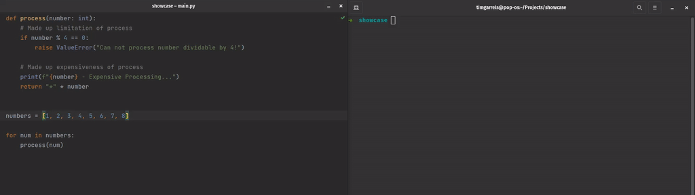
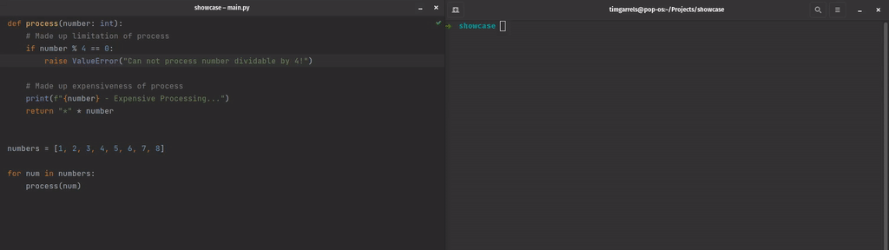

# PickMeUp - Pick up failed list processing without re-processing

**PickMeUp** allows to pick up a failed processing of elements.
```python
elements = [1,2,3,4,5,6,7,8]
with PickMeUp(elements, name="element_processing") as l:
    for e in l:
        result = process(e)
        save(result)
```

If `process` fails for elements dividable by 4, the script crashes. You now have to fix `process` and re-run the script.
Normally, you would re-process 1, 2, and 3. However, you already have results for those! And `process` might be expensive.
**PickMeUp** will know that the processing failed at 4, and will only iterate over 4, 5, 6, 7, and 8, saving you from re-processing.

### Without PickMeUp
1. Process 1,2,3
2. Fix `process`
3. Process 1,2,3,4,5,6,7,8 


### With PickMeUp
1. Process 1,2,3
2. Fix `process`
3. Process 4,5,6,7,8



## Installation
TODO

## Usage
Create a context using your list and a name, and use the context element as your list:
```python
with PickMeUp(yourList, "some_unique_name") as l:
    for e in l:
        # Do stuff with e
```

## Example Use-Case: Scraping
Imagine you want to crawl content from a website.
You have a list of 50 content pages, and you want to extract the `src` of one specific image from each page.
You wrote the extractor (identifying the important image, extracting the `src`) by looking at the first 2 pages.
It seems that the important image can be identified with the `id=important-image`:
```python
import requests
from bs4 import BeautifulSoup


def scrape(url: str) -> str:
    """Returns the html of the given `url`"""
    resp = requests.get(url)
    return resp.content

def extract_important_image_src(html: str) -> str:
    """Finds the important image in the given `html` and
    returns its `src` attribute"""
    soup = BeautifulSoup(html)
    return soup.find('img', {'id': 'important-image'})['src']

URLS = ["example.com/content/1", "example.com/content/2", ...] 
for url in URLS:
    html = scrape(url)
    src = extract_important_image_src(html)
    print(f"{src} extracted!")
```

However, it just so happens that half of the content pages follow an old design, and those pages mark their image with `id=important`.
Your extractor breaks, because there is no element with `id=important-image` and the subscript `['src']` fails:
```bash
> "example.com/content/1 extracted!"
> ...
> "example.com/content/25 extracted!"
> TypeError: 'NoneType' object is not subscriptable
```

So you enhance `extract_important_image_src` to handle the old design. But now you have to parse the first 25 pages again!
Or skip them manually. Instead, if you used **PickMeUp**:

```python
URLS = ["example.com/content/1", "example.com/content/2", ...]
with PickMeUp(URLS, name="url_processing") as l:
    for url in l:
        html = scrape(url)
        src = extract_important_image_src(html)
        print(f"{src} extracted!")
```

You could just update `extract_important_image_src` and re-run your script.
It will pick up the scraping at the element that failed, and proceed as if nothing happened.
If there is another design change somewhere, the processing will fail again. But again, you can fix the issue and re-run the script,
without re-processing all the urls that worked before!

## Caveats

**PickMeUp** creates state for your processing by dumping the remaining elements to disk. This creates a few caveats:
- If your elements are really large objects, this will take much disk space.
- If you are using a generator, and the elements are expensive to create, **PickMeUp** will take the time to create them all and dump them to disk.
- Changing the list elements between script runs without clearing state creates undefined behavior!
- List elements have to be serializable!
